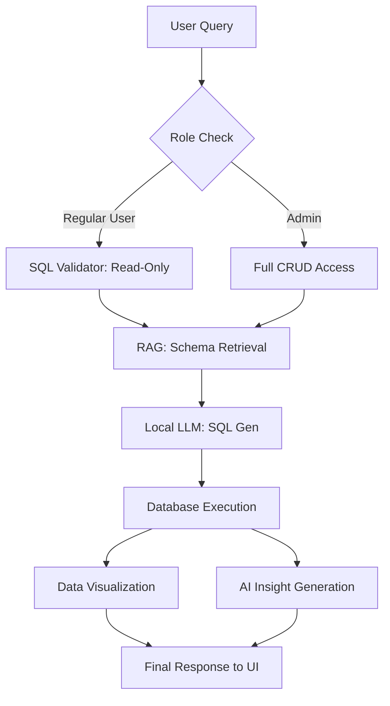

# 

# 🤖 ChatSQL: Professional NL-to-SQL Intelligence

[](https://www.python.org/)
[](https://fastapi.tiangolo.com/)
[](https://ollama.com/)
[](LICENSE)

**ChatSQL** is an elite, production-ready Text-to-SQL platform that enables users to interact with structured databases using natural language. Built with a **Privacy-First** philosophy, it operates 100% offline using local LLMs (Mistral/Llama) and an advanced RAG (Retrieval-Augmented Generation) pipeline.

---

## 🌟 Key Features

### 🧠 Intelligent Core
- **Natural Language Querying**: Talk to your database. Ask questions like *"Who are my top 10 customers by revenue?"* or *"Summarize last month's sales."*
- **RAG-Powered Context**: Uses FAISS vector indexing to provide the LLM with relevant schema fragments, ensuring high accuracy even with complex table structures.
- **Smart Auto-Indexing**: Automatically detects schema changes (CREATE/ALTER/DROP) and updates the vector index in real-time.

### 📊 Visual Analytics & Insights
- **Automatic Visualization**: Dynamically generates Bar, Line, and Pie charts based on query results using Matplotlib.
- **Automated Dashboards**: Ask for a "Dashboard of sales performance," and the system generates a multi-component layout with metrics and graphs.
- **AI Insights**: Provides non-technical, human-readable summaries for every query result, making data accessible to everyone.
- **CSV Export**: Professional data export capabilities for all query results.

### 🛡️ Secure Admin Ecosystem
- **Role-Based Access Control (RBAC)**: Secure separation between regular users (Read-Only) and administrators (Full CRUD).
- **User Management**: Admin approval workflow for new registrations.
- **Action Auditing**: Every administrative action and NLP-driven modification is logged for security compliance.
- **Raw SQL Terminal**: Direct execution for power users with a built-in safety-first approach.

---

## 🛠️ Technology Stack

| Component | Technology | Role |
| :--- | :--- | :--- |
| **Backend** | FastAPI (Python) | High-performance API orchestration |
| **Intelligence** | LangChain + Ollama | Local LLM inference (Mistral-7B) |
| **Knowledge Base** | FAISS | Schema embedding and retrieval |
| **Security** | JWT + Argon2 | Secure session & password management |
| **Visualization** | Matplotlib / Pandas | On-the-fly chart generation |
| **Frontend** | Vanilla JS / CSS | Premium, responsive Glassmorphic UI |

---

## 📐 How It Works



---

## 🚀 Quick Start Guide

### Prerequisites
1.  **Ollama**: Install from [ollama.com](https://ollama.com/)
2.  **Model**: Pull the default model:
    ```bash
    ollama pull mistral
    ```

### Installation
1.  **Clone & Setup**:
    ```bash
    git clone https://github.com/KAVIRASU237/chat-SQL.git
    cd chat-SQL
    python -m venv .venv
    # Windows
    .venv\Scripts\activate
    # Linux/Mac
    source .venv/bin/activate
    pip install -r requirements.txt
    ```

2.  **Initialize Database**:
    ```bash
    python -m backend.utils.setup_sample_db
    ```

3.  **Launch Platform**:
    ```bash
    uvicorn backend.main:app --reload
    ```

4.  ### Access & Default Credentials
- **User Portal**: [http://localhost:8000](http://localhost:8000)
- **Admin Dashboard**: [http://localhost:8000/adminlogin](http://localhost:8000/adminlogin)
- **Default Admin**: `admin` / `admin123`
- **API Docs**: [http://localhost:8000/docs](http://localhost:8000/docs)

---

## 📽️ Features Walkthrough

````carousel
### 💬 Chat Interface

Query your data naturally and get instant SQL + Insights.
<!-- slide -->
### 📊 Visual Analytics
Automatically generate charts and graphs from your query results.
<!-- slide -->
### 🔒 Admin Control
Full CRUD capabilities and action logging in a secure portal.
````

---

## 🔐 Security & Privacy

- **100% Local**: No data ever leaves your machine. Perfect for sensitive enterprise data.
- **Audit Logs**: Transparent tracking of who did what and when.
- **Safe Execution**: Multi-layer validation prevents destructive commands from unauthorized users.

---

## 📂 Project Structure

```text
├── backend/
│   ├── core/           # Configuration & Configs
│   ├── routers/        # API Endpoints (Admin/General)
│   ├── services/       # RAG, SQL Gen, Graph, Auth Services
│   └── utils/          # SQL Validators, Schema Extractors
├── frontend/
│   ├── static/         # HTML, CSS, JS Assets
│   └── index.html      # Main Entrance
├── data/
│   ├── sample.db       # Application Data
│   └── admin.db        # Admin Audit Logs & Credentials
└── requirements.txt    # Project Dependencies
```

---

## 🖼️ Application Gallery

| Dashboard Interface | Data Insights |
| :---: | :---: |
|  |  |

---

## 👥 Contributors & Support

Developed with ❤️ by **Kavirasu**.

- **Repo**: [KAVIRASU237/chat-SQL](https://github.com/KAVIRASU237/chat-SQL)
- **License**: MIT License

---

